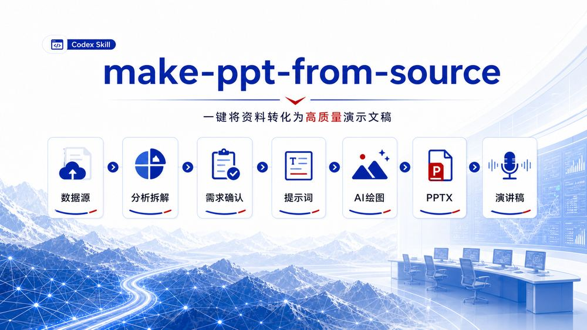
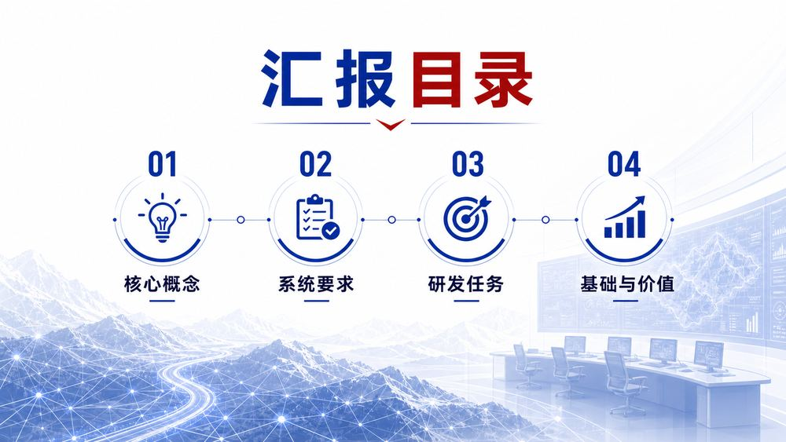
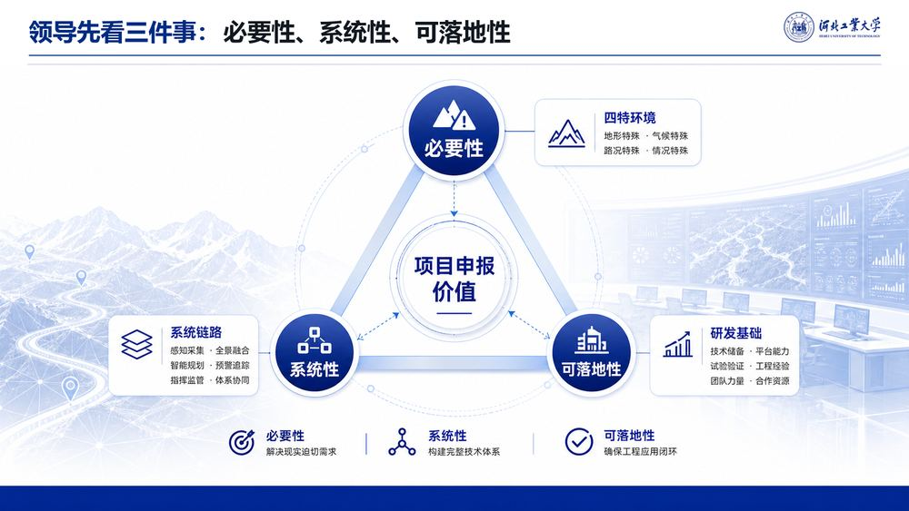

# make-ppt-from-source


`make-ppt-from-source` 是一套面向 Codex 的 PPT 制作工作流 Skill。它会先读取用户上传的数据源，拆解内容结构，再参考 `ppt-master` 的提问方式确认 PPT 类型、受众、页数、风格、母版、图像策略等关键要求，随后生成两类提示词文档，调用 AI 绘图模型逐页出图，最终合成为完整 PPTX，并继续生成配套演讲稿。



## 适用场景

- 项目申报答辩、课题评审、科研汇报
- 商务路演、融资汇报、解决方案展示
- 政务科技、工程方案、技术产品说明
- 需要“资料分析 -> 提示词 -> AI 绘图 -> PPTX -> 演讲稿”的完整自动化流程

## 工作流

1. 用户上传 PPT 数据源，例如 DOCX、PDF、Markdown、表格、网页资料或已有 PPT。
2. Skill 分析数据源，拆解主题、论证链条、章节结构、关键图表和可视化线索。
3. 参考 `ppt-master` 的需求确认方式，向用户确认页数、比例、受众、答辩场景、视觉风格、品牌约束和是否需要参考 PPT 母版。
4. 生成完整答辩 PPT 提示词文档，覆盖叙事逻辑、逐页内容、版式要求、视觉风格和交付标准。
5. 生成每页 PPT 对应的 AI 绘图 Prompt，明确画面主体、构图、色彩、信息层级和禁止项。
6. 调用 AI 绘图模型，例如 image2 / GPT Image 2，逐页生成 PPT 页面图片。
7. 将逐页图片编辑、排版并合成为完整 PPTX 文件。
8. 基于最终 PPT 和原始数据源，生成逐页演讲稿、转场语、时间分配和可能问答。

## 核心输出

| 输出物 | 默认文件名 | 用途 |
|---|---|---|
| 完整 PPT 提示词 | `ppt_complete_prompt.md` | 给 PPT 生成模型或策划人员使用 |
| 逐页 AI 绘图 Prompt | `per_slide_image_prompts.md` | 指导图像模型逐页生成页面图 |
| 逐页页面图 | `slide_001.png` 等 | 每页 PPT 的视觉成图 |
| 完整 PPT 文件 | `.pptx` | 最终答辩或汇报文件 |
| 配套演讲稿 | `presentation_speech_script.md` | 逐页口播、转场和 Q&A |

## 案例展示

以下图片均为位图素材，不使用 SVG 重绘。工作流图由 AI 绘图模型生成；案例页来自本地已有 PPT 中相对通用、无明显敏感细节的页面截图。

### AI 绘图模型生成的工作流图


### PPT 案例页：汇报目录



### PPT 案例页：答辩价值说明



## 需求确认清单

正式生成前，Skill 会先确认这些信息，避免后面返工：

| 确认项 | 说明 |
|---|---|
| PPT 类型 | 项目申报、答辩、路演、汇报、课程展示等 |
| 画布比例 | 默认 16:9，也可指定 4:3、竖版或其他比例 |
| 页数范围 | 总页数、章节页数量、是否需要封面和结束页 |
| 目标受众 | 领导、专家、投资人、技术团队、客户等 |
| 叙事重点 | 必要性、创新性、可行性、价值、风险、落地计划等 |
| 视觉风格 | 科技、政务、学术、商务、极简、品牌定制等 |
| 图片策略 | AI 绘图、真实照片、图标、数据图表、信息图等 |
| PPT 母版 | 是否上传参考母版、品牌模板或历史 PPT |
| 演讲稿要求 | 总时长、语气、逐页稿、问答稿、是否需要精简版 |

## 仓库结构

```text
skills/make-ppt-from-source/
  SKILL.md
  agents/openai.yaml
  references/prompt-documents.md
  references/requirements-checklist.md
  references/speaker-script.md
assets/
  workflow-ai-generated.jpg
  case-toc-page.jpg
  case-value-page.jpg
```

## 使用方式

在 Codex 中安装或同步该仓库后，可以直接用一句话触发：

```text
使用 make-ppt-from-source，根据我上传的数据源制作一套项目申报答辩 PPT，并生成演讲稿。
```

如果需要同步更新到 GitHub，可以这样说：

```text
把 make-ppt-from-source 这个 skill 同步到 GitHub 仓库 miraclechen0816/make-ppt-from-source，路径放在 skills/make-ppt-from-source/，直接更新 main 分支。
```

## 设计原则

- 先问清要求，再开始生成。
- 先生成提示词文档，再调用绘图模型。
- 每页图像都要服务于 PPT 叙事，不做无意义装饰。
- 最终交付包括 PPTX、提示词文档、逐页图片和演讲稿。
- 涉及真实项目时，优先脱敏展示，避免把敏感细节放进公开仓库。
