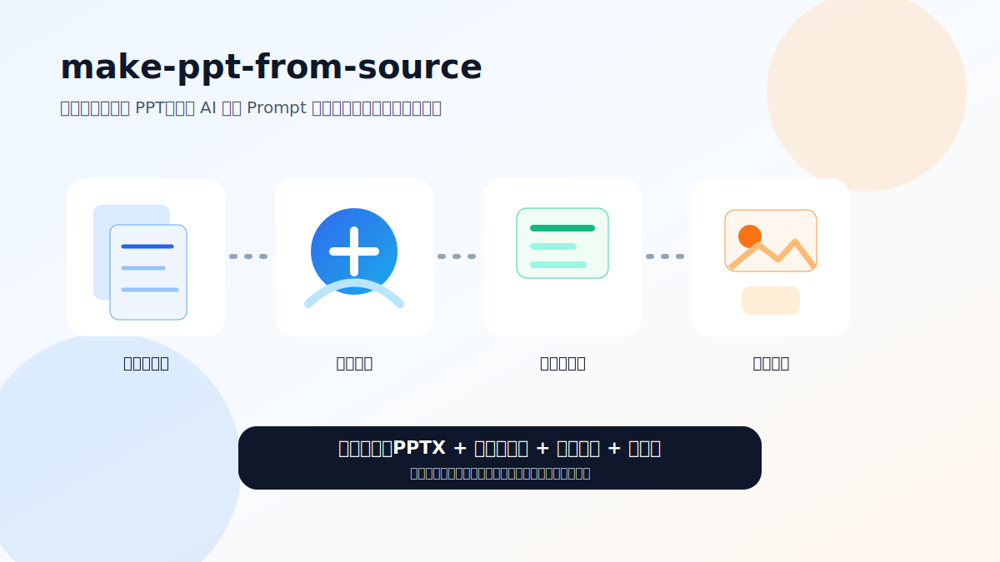
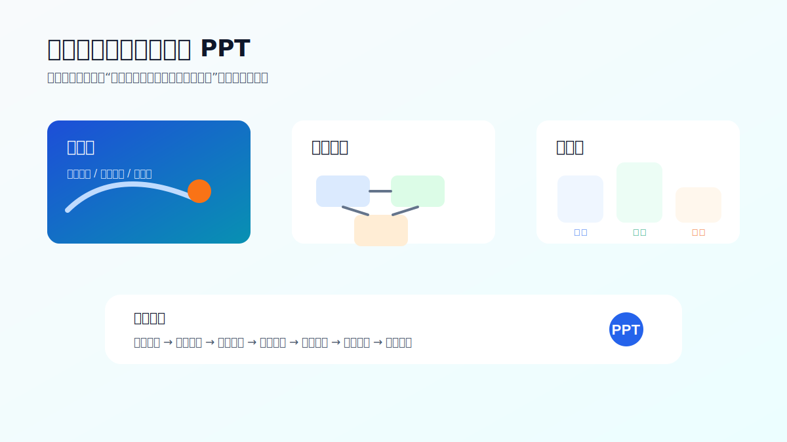
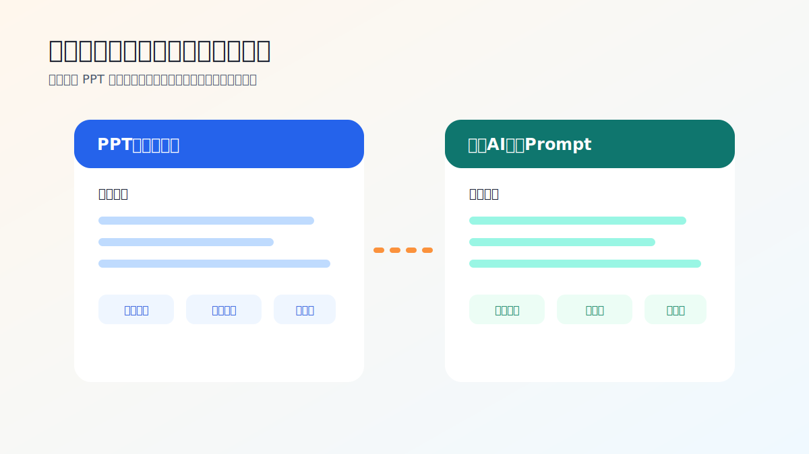

# make-ppt-from-source


`make-ppt-from-source` 是一套面向 Codex 的 PPT 制作工作流 Skill。它可以把用户上传的数据源拆解成完整的答辩 PPT 方案，生成整套 PPT 提示词、逐页 AI 绘图 Prompt，调用图像模型逐页出图，最后合成为 PPTX，并基于最终 PPT 与原始数据源生成配套演讲稿。



## 适用场景

- 项目申报答辩
- 课题或学术答辩
- 商务路演
- 工作汇报
- 技术方案汇报
- 需要“先生成提示词，再逐页绘图，再合成 PPT”的自动化流程

## 工作流


## 主要输出

| 输出物 | 默认文件名 | 用途 |
|---|---|---|
| PPT完整提示词 | `ppt_complete_prompt.md` | 给 PPT 生成类 AI 或策划人员使用 |
| 逐页AI绘图Prompt | `per_slide_image_prompts.md` | 指导图像模型逐页生成 PPT 背景图和信息图 |
| 逐页图片 | `slide_001.png` 等 | 每页 PPT 的完整视觉稿 |
| PPT文件 | `.pptx` | 最终答辩或汇报文件 |
| 配套演讲稿 | `presentation_speech_script.md` | 按最终 PPT 页序生成口播稿、转场语和 Q&A |

## 案例展示

### 案例一：项目申报答辩

面向项目申报、课题评审或领导汇报，将复杂材料拆成“背景、方案、任务、指标、基础、价值”的答辩逻辑。



### 案例二：两类提示词文档

Skill 会生成两份核心提示词文档：一份负责整套 PPT 的叙事与页级内容，一份负责逐页 AI 绘图。



### 案例三：配套演讲稿

演讲稿不是照读页面，而是基于最终 PPT 和原始数据源补足讲述逻辑、转场语、时间分配与评审问答。


## 需求确认清单

正式生成之前，Skill 会参考 `ppt-master` 的确认方式，先让用户确认关键要求：

| 确认项 | 说明 |
|---|---|
| 画布比例 | 16:9、4:3、竖版等 |
| 页数范围 | 建议页数、硬性页数或答辩时长 |
| 目标受众 | 领导、专家、投资人、技术团队等 |
| 风格目标 | 学术严谨、科技政务、咨询汇报、简洁商务等 |
| 色彩方案 | 主色、辅助色、强调色，是否沿用母版 |
| 图标策略 | 线性图标、系统图标、少图标等 |
| 字体计划 | 中文/英文字体与标题层级 |
| 图片策略 | AI绘图、数据图表、真实照片、抽象背景等 |
| PPT母版 | 是否上传参考 PPT 母版或品牌模板 |
| 演讲稿 | 总时长、语气、逐页稿、完整稿、Q&A |

## 仓库结构

```text
make-ppt-from-source/
  README.md
  assets/
    readme-hero.svg
    case-project-defense.svg
    case-prompt-docs.svg
    case-speech-script.svg
  skills/
    make-ppt-from-source/
      SKILL.md
      agents/
        openai.yaml
      references/
        prompt-documents.md
        requirements-checklist.md
        speaker-script.md
```

## 如何调用

在 Codex 中可以这样调用：

```text
使用 $make-ppt-from-source：请上传PPT数据源，我会分析拆解内容，确认PPT要求与母版参考，生成提示词、逐页绘图、合成PPT，并基于最终PPT和数据源生成配套演讲稿。
```

也可以更自然地说：

```text
使用 $make-ppt-from-source，根据我上传的项目申报材料制作一套答辩PPT，并生成逐页AI绘图Prompt和配套演讲稿。
```

## 安全与风格规则

该 Skill 对敏感、国防、安全、防护等内容采用抽象表达策略：

- 使用系统框图、传感器图标、地图网格、告警标识和抽象轮廓。
- 不生成真实武器细节、攻击场面、战术部署细节或危险操作说明。
- 不把 PPT 写成论文正文，优先使用图示化表达。
- 对复杂表格进行拆页、矩阵化、流程化或指标卡表达。

## 文件说明

- [`SKILL.md`](./skills/make-ppt-from-source/SKILL.md)：主工作流说明。
- [`agents/openai.yaml`](./skills/make-ppt-from-source/agents/openai.yaml)：Codex UI 展示信息。
- [`references/requirements-checklist.md`](./skills/make-ppt-from-source/references/requirements-checklist.md)：需求确认清单。
- [`references/prompt-documents.md`](./skills/make-ppt-from-source/references/prompt-documents.md)：两类提示词文档规范。
- [`references/speaker-script.md`](./skills/make-ppt-from-source/references/speaker-script.md)：演讲稿生成规范。

## License

请根据你的仓库实际授权方式补充 License。
